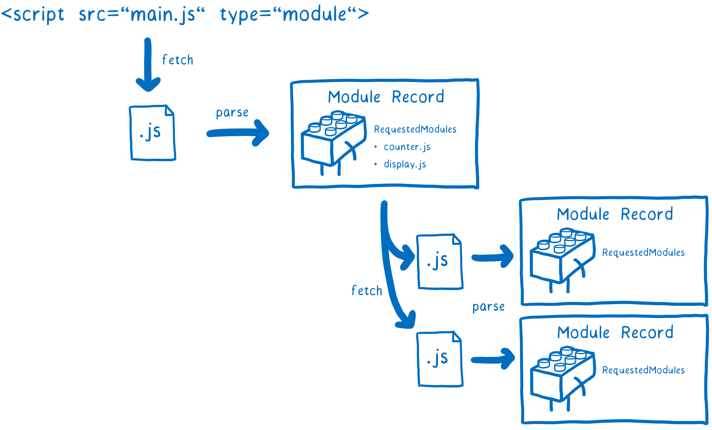

# Introduction

Offbase is a new approach to building web apps, backed by git (distributed) instead of relying on a server (centralized). With Offbase you can build web apps without a server.

<blockquote class='notice'>
<h4>Notice</h4>
 
Official documentation with full API is coming soon! If you're interested, stay updated through:

<ol>
<li><a href="https://offbase.org/invite">Newsletter</a>: receive occasional updates and digest</li>
<li><a href="https://twitter.com/skogard">Twitter</a>: follow the raw development process, participate in conversations, and ask questions.</li>
</ol>
</blockquote>

---

# How it works

## 1. Git instead of Cloud

Offbase replaces centralized server with distributed git.

Instead of storing your content in a centralized DB, Offbase lets you store content in your own Git, a portable distributed version control system. Because it's a portable format, you can store it anywhere, and never get locked into an application platform.

### Cloud Model (Before)

> Read/Write to Centralized Database

In a tranditional content management system, you store content to a cloud, and serve from the cloud. You depend on the server.

### Offbase Model (After)

> Read/Write to Git

In Offbase, you boot up your workspace in the browser by pulling from your remote git repository, work offline, and synchronize later by pushing.

And all of this happens inside the browser (Offbase uses [Isomorphic Git](https://isomorphic-git.org/) for this).

## 2. Service Worker instead of SaaS

Offbase replaces "software as a service" with a downloadable offline-first web app, powered by service worker.

This means there is no "cloud service" behind Offbase. The offbase.org only acts as a blank slate medium to load your own "fat" Offbase packages (such as the blogging engine) and content locaally on your browser (Service Worker needs an HTTPS URL)

Traditional CMS applications require a server. Offbase uses [Service Worker](https://developer.mozilla.org/en-US/docs/Web/API/Service_Worker_API/Using_Service_Workers) to emulate an instant cloud environment inside your browser. Internally there's a programmable router that maps HTTP requests to the virtual file system created from the git repository, and the CMS web app loads files directly from the virtual file system over HTTP, locally. This way, Offbase implements a CMS that doesn't need a server.

Because the HTML page alone can create a cloud-like environment, you can do a lot of things that you normally need servers for, without actually connecting to a server.

## 3. Native ES modules instead of compiled JS bundles

Offbase takes full advantage of, and encourages the use of [native ES modules](https://hacks.mozilla.org/2018/03/es-modules-a-cartoon-deep-dive/).

Because Offbase is designed to work purely in the browser, it uses pure web standard technologies.

Everything in Offbase is purely written in vanilla HTML, JavaScript, and CSS.

There is **no special web app framework and no special markup language** (all of which require backend powered compilation and transpilation). Everything is transparent and anyone can view the HTML source of an Offbase app and understand how it works.

To implement self contained modules it uses browser native ES modules instead of backend-compiled JavaScript bundles.

---

# Example

## Offpress

Offpress is a blogging engine powered by Offbase. Thanks to Offbase, it's possible to create a static site generator inside a browser.

Check it out here: https://offpress.app

---

